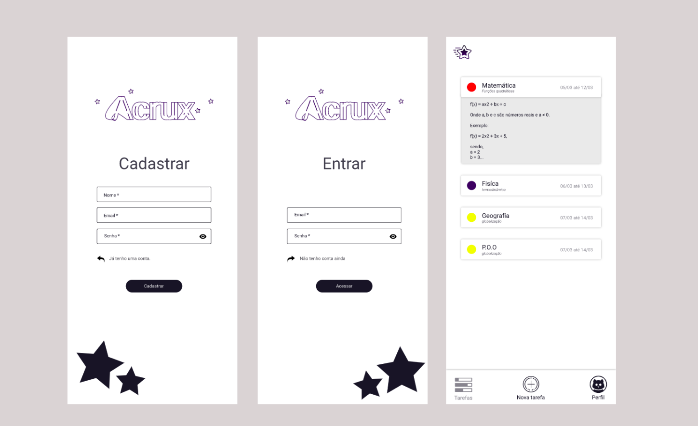

  
  <h2 align="center">
  Aplicativo Acrux - Gestão de tempo e lazer!
  </h2>

## Telas

## Requisitos funcionais

<ul style="text-decoration: none">
  <li>Cadastro de usuários</li>
  <li>Cadastro de tarefas</li>
  <li>Listagem de tarefas</li>
  <li>Update de tarefas e perfil</li>
</ul>

## Requisitos não funcionais

Manda notificação sempre que uma tarefa está perto do fim de seu prazo

